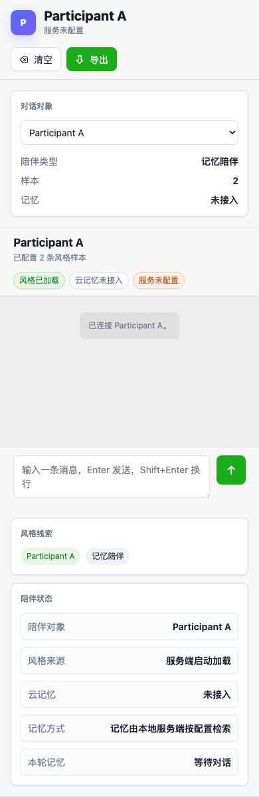

# wechat-skill-distill

`wechat-skill-distill` 是一个本地优先的微信聊天记录蒸馏工具。它把 WeFlow 导出的微信私聊 JSON 转成可复用的聊天 skill、记忆数据包和本地智能陪伴网页。

这个项目不负责导出微信数据。请先用 [WeFlow](https://github.com/hicccc77/WeFlow) 导出 JSON，再用本项目处理。


## 这个代码库能做什么

| 能力 | 产物 | 适合谁 |
| --- | --- | --- |
| 提取说话风格 | `*.skill` | 想审查或复用某个人微信语气的用户 |
| 生成长期记忆 | `memory.jsonl` 或写入云记忆 | 想把聊天事实、时间线、偏好放进记忆库的用户 |
| 生成带记忆的聊天 skill | `*.chat-memory.skill` | 想让 agent 必要时检索记忆再按风格回复的用户 |
| 本地网页试聊 | `chat-ui` | 想直接体验智能陪伴效果的用户 |

项目支持 JSONL、Hindsight、Mem0 和通用 HTTP 记忆后端。浏览器不会收到 API key、模型地址、完整 skill、user_id 或原始记忆命中。

## 新手从这里开始

建议按下面顺序阅读：

1. [WeFlow 导出教程](docs/WEFLOW_EXPORT.md)：从 WeFlow 导出微信私聊 JSON。
2. [新手入门](docs/GETTING_STARTED.md)：安装、配置参与者、生成 skill、启动网页。
3. [配置指南](docs/CONFIGURATION.md)：解释 `config.local.json`、`.env`、模型和记忆后端。
4. [用户示例](docs/USER_EXAMPLES.md)：按“只要风格”“本地记忆试聊”“云记忆陪伴”等目标选择命令。
5. [完整案例教程](docs/CASE_TUTORIAL.md)：用 `examples/chat.json` 跑通完整流程。
6. [云部署指南](docs/DEPLOYMENT.md)：把后端部署到 Koyeb，把静态前端部署到 Tiiny Host。

## 10 分钟跑通示例

```bash
git clone https://github.com/xmh1011/wechat-skill-distill.git
cd wechat-skill-distill
python3 -m venv .venv
. .venv/bin/activate
pip install -e .
cp .env.example .env
cp config.example.json config.local.json
```

检查示例聊天：

```bash
wechat-skill-distill inspect --input examples/chat.json --config config.example.json
```

示例输出会类似：

```text
messages: raw=5 importable=4 skipped=1
participants:
  - participant_a (Participant A): 2 messages
  - participant_b (Participant B): 2 messages
```

生成纯风格 skill：

```bash
wechat-skill-distill extract-skills \
  --input examples/chat.json \
  --out-dir /tmp/wsd-demo/generated-skills \
  --config config.example.json
```

生成带记忆规则的 chat skill：

```bash
wechat-skill-distill generate-chat-skills \
  --input examples/chat.json \
  --out-dir /tmp/wsd-demo/generated-chat-skills \
  --memory-backend jsonl \
  --config config.example.json
```

生成本地 JSONL 记忆包：

```bash
wechat-skill-distill import \
  --backend jsonl \
  --input examples/chat.json \
  --output /tmp/wsd-demo/memory.jsonl \
  --dry-run \
  --config config.example.json
```

配置 `.env` 后启动网页：

```bash
wechat-skill-distill chat-ui \
  --host 127.0.0.1 \
  --port 8765 \
  --env-file .env \
  --skill /tmp/wsd-demo/generated-chat-skills/Participant\ A.chat-memory.skill
```

移动窄屏界面：



## 配置最小例子

### 参与者配置

`config.local.json` 用来告诉工具“哪一方是谁”。WeFlow 通常有 `isSend` 字段，常见写法：

```json
{
  "participants": {
    "0": { "user_id": "friend", "name": "朋友" },
    "1": { "user_id": "me", "name": "我" }
  }
}
```

如果你的 WeFlow JSON 里有稳定的 `senderUsername`，也可以用它做 key。详情见 [配置指南](docs/CONFIGURATION.md)。

### 模型配置

`.env` 用来配置模型服务。OpenAI-compatible 网关示例：

```bash
WSD_MODEL_PROVIDER=openai
WSD_OPENAI_BASE_URL=https://api.openai.com/v1
WSD_OPENAI_MODEL=gpt-4.1-mini
WSD_OPENAI_API_KEY=...
```

也支持 Anthropic 和 Gemini，见 [.env.example](.env.example) 和 [配置指南](docs/CONFIGURATION.md)。

### 记忆配置

先用 JSONL dry-run 是最稳妥的：

```bash
WSD_MEMORY_RECALL_BACKEND=jsonl
JSONL_MEMORY_PATH=/tmp/wsd-demo/memory.jsonl
```

确认效果后再接 Hindsight、Mem0 或通用 HTTP 记忆服务。

## 常用命令

| 目标 | 命令 |
| --- | --- |
| 检查导出文件 | `wechat-skill-distill inspect --input data/my-chat.json --config config.local.json` |
| 检查环境 | `wechat-skill-distill doctor --input data/my-chat.json --config config.local.json` |
| 脱敏聊天记录 | `wechat-skill-distill redact --input data/my-chat.json --output data/my-chat.redacted.json --report reports/redaction.json` |
| 生成纯风格 skill | `wechat-skill-distill extract-skills --input data/my-chat.json --out-dir generated-skills --config config.local.json` |
| 生成带记忆 skill | `wechat-skill-distill generate-chat-skills --input data/my-chat.json --out-dir generated-chat-skills --memory-backend jsonl --config config.local.json` |
| 本地记忆 dry-run | `wechat-skill-distill import --backend jsonl --input data/my-chat.json --output exports/memory.jsonl --dry-run --config config.local.json` |
| 启动网页试聊 | `wechat-skill-distill chat-ui --env-file .env --skill generated-chat-skills/朋友.chat-memory.skill` |
| 评估 skill | `wechat-skill-distill evaluate-skills --skills generated-skills generated-chat-skills --input data/my-chat.json --config config.local.json` |

## 云部署

Tiiny Host 只能托管静态前端；完整聊天需要一个后端服务承载 `/api/runtime`、`/api/skills` 和 `/api/chat`。推荐用 Koyeb 免费 Web Service 部署仓库里的 `Dockerfile`，再把 Tiiny 前端通过 `?apiBase=https://your-app.koyeb.app` 指向后端。

云端不要提交私有 `*.chat-memory.skill` 或 `.env`。可以把 skill 内容 base64 后配置为 `WSD_SKILL_1_TEXT_BASE64`，把模型、记忆、CORS 和 `WSD_CHAT_AUTH_TOKEN` 访问令牌放在云平台环境变量中。详细步骤见 [云部署指南](docs/DEPLOYMENT.md)。

## 产物区别

| 命令 | 输出 | 是否包含记忆规则 | 用途 |
| --- | --- | --- | --- |
| `extract-skills` | `某人.skill` | 否 | 只模仿说话风格，适合先人工审查 |
| `generate-chat-skills` | `某人.chat-memory.skill` | 是 | 回复事实问题时先检索记忆，再按风格回答 |
| `import --backend jsonl` | `memory.jsonl` | 不适用 | 本地可审查的记忆数据包 |

`evaluate-skills` 会检查章节、身份边界、样本泄漏和风格完整度。缺少表达节奏、问句占比、多行消息占比或表情/符号倾向时会给出 warning，帮助你判断 skill 是否过薄。

## 隐私与安全

- `.env`、原始聊天 JSON、`data/`、`exports/`、`generated-skills/`、`generated-chat-skills/`、`logs/`、`runs/` 默认不提交。
- 导入云记忆前，先用 `--dry-run` 生成本地 JSONL 检查。
- 对外分享前，先运行 `redact` 脱敏手机号、邮箱、URL、身份证、银行卡等内容。
- 生成的 skill 不会写入 API key。
- 如果记忆里没有证据，chat skill 会要求降低确定性或追问，而不是编造事实。

## 开发检查

```bash
python3 -m unittest discover -s tests
python3 -m py_compile wechat_skill_distill/*.py
node --check wechat_skill_distill/web/app.js
```

## 更多文档

- [docs/GETTING_STARTED.md](docs/GETTING_STARTED.md)：新手入门。
- [docs/CONFIGURATION.md](docs/CONFIGURATION.md)：配置指南。
- [docs/USER_EXAMPLES.md](docs/USER_EXAMPLES.md)：按用户目标组织的使用示例。
- [docs/CASE_TUTORIAL.md](docs/CASE_TUTORIAL.md)：完整案例教程。
- [docs/WEFLOW_EXPORT.md](docs/WEFLOW_EXPORT.md)：WeFlow JSON 导出教程。
- [docs/DEPLOYMENT.md](docs/DEPLOYMENT.md)：Koyeb 后端 + Tiiny 静态前端部署。
- [PRD.md](PRD.md)：产品范围、场景和路线图。
- [docs/research/open-source-review.md](docs/research/open-source-review.md)：开源项目调研记录。
