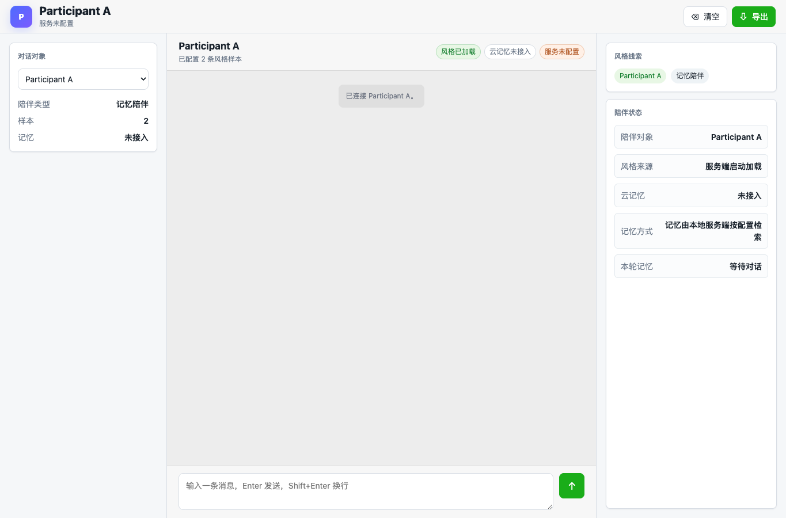

# 案例教程：从聊天记录到智能陪伴

这个案例用仓库自带的 `examples/chat.json` 演示完整流程。真实使用时，把示例文件替换成你的 WeFlow JSON。

## 案例目标

我们要完成四件事：

1. 检查聊天 JSON 能否解析。
2. 生成两个参与者各自独立的风格 skill。
3. 生成可接记忆的 chat skill 和本地 JSONL 记忆包。
4. 启动网页，和其中一个人物试聊。

## 目录准备

```bash
python3 -m venv .venv
. .venv/bin/activate
pip install -e .
cp .env.example .env
cp config.example.json config.local.json
```

示例 `config.example.json` 已经能匹配 `examples/chat.json`。真实数据需要你自己改参与者映射。

## 第一步：检查输入文件

```bash
wechat-skill-distill inspect --input examples/chat.json --config config.example.json
```

你应该看到类似信息：

```text
raw messages: 2
importable messages: 2
participants: Participant A, Participant B
```

如果 `importable messages` 很低，说明导出里可能大多是非文本消息，或者 parser 不支持当前格式。

## 第二步：生成纯风格 skill

```bash
rm -rf /tmp/wsd-demo/generated-skills
wechat-skill-distill extract-skills \
  --input examples/chat.json \
  --out-dir /tmp/wsd-demo/generated-skills \
  --config config.example.json
```

查看结果：

```bash
ls /tmp/wsd-demo/generated-skills
```

示例输出：

```text
Participant A.skill
Participant B.skill
```

纯风格 skill 适合做提示词审查。它不会包含 Hindsight、Mem0、Generic HTTP 或 JSONL 记忆规则。

## 第三步：生成带记忆 chat skill

```bash
rm -rf /tmp/wsd-demo/generated-chat-skills
wechat-skill-distill generate-chat-skills \
  --input examples/chat.json \
  --out-dir /tmp/wsd-demo/generated-chat-skills \
  --memory-backend jsonl \
  --config config.example.json
```

示例输出：

```text
Participant A.chat-memory.skill
Participant B.chat-memory.skill
```

这些文件会多出 `## 记忆检索` 章节，用来告诉 agent 在回答具体事实时如何 recall。

## 第四步：生成本地 JSONL 记忆包

```bash
mkdir -p /tmp/wsd-demo/exports
wechat-skill-distill import \
  --backend jsonl \
  --input examples/chat.json \
  --group-by message \
  --output /tmp/wsd-demo/exports/memory.jsonl \
  --dry-run \
  --config config.example.json
```

检查文件：

```bash
head -n 2 /tmp/wsd-demo/exports/memory.jsonl
```

每行都是一条结构化记忆，包含 `content`、`metadata`、`timestamp`、`participants` 和 `tags`。

## 第五步：启动网页试聊

真实调用模型前，先在 `.env` 中配置模型服务。支持三类协议：

```bash
# OpenAI-compatible
WSD_MODEL_PROVIDER=openai
WSD_OPENAI_BASE_URL=https://api.openai.com/v1
WSD_OPENAI_MODEL=gpt-4.1-mini
WSD_OPENAI_API_KEY=...
```

也可以配置 Anthropic 或 Gemini，见 `.env.example`。

启动网页：

```bash
wechat-skill-distill chat-ui \
  --host 127.0.0.1 \
  --port 8765 \
  --env-file .env \
  --skill /tmp/wsd-demo/generated-chat-skills/Participant\ A.chat-memory.skill
```

打开终端打印的 URL。页面会显示当前陪伴对象、是否接入云记忆、服务是否已连接、对话窗口和导出按钮。



## 第六步：接入云记忆

### Hindsight

```bash
HINDSIGHT_API_URL=https://cloud.memory.example.com/api
HINDSIGHT_BANK_ID=wechat-memory
HINDSIGHT_API_KEY=...
WSD_MEMORY_RECALL_BACKEND=hindsight
```

导入：

```bash
wechat-skill-distill import \
  --backend hindsight \
  --input data/my-chat.json \
  --group-by day \
  --config config.local.json
```

### Mem0

```bash
pip install -e '.[mem0]'
MEM0_API_KEY=...
WSD_MEMORY_RECALL_BACKEND=mem0
```

导入：

```bash
wechat-skill-distill import \
  --backend mem0 \
  --input data/my-chat.json \
  --group-by message \
  --config config.local.json
```

### 通用 HTTP

```bash
MEMORY_WRITE_URL=https://memory.example.com/import
MEMORY_RECALL_URL=https://memory.example.com/recall
MEMORY_API_KEY=...
WSD_MEMORY_RECALL_BACKEND=generic-http
```

这个模式适合接内部记忆服务。

## 第七步：质量检查

```bash
wechat-skill-distill evaluate-skills \
  --skills /tmp/wsd-demo/generated-skills /tmp/wsd-demo/generated-chat-skills \
  --input examples/chat.json \
  --config config.example.json \
  --output /tmp/wsd-demo/quality.json
```

检查点包括：

- 是否缺少必要章节。
- 纯风格 skill 是否混入记忆配置。
- chat-memory skill 是否缺少记忆检索章节。
- 是否把另一个参与者的身份或口头禅混进当前 skill。
- 风格画像是否过薄。

## 真实项目建议流程

1. WeFlow 导出 JSON。
2. `inspect` 确认参与者和消息数。
3. `redact` 脱敏敏感信息。
4. `extract-skills` 生成纯风格 skill，人工审查。
5. `import --backend jsonl --dry-run` 本地检查记忆。
6. 确认后再导入云记忆。
7. `generate-chat-skills` 生成 chat-memory skill。
8. `chat-ui` 试聊。
9. `evaluate-skills` 做质量检查。
